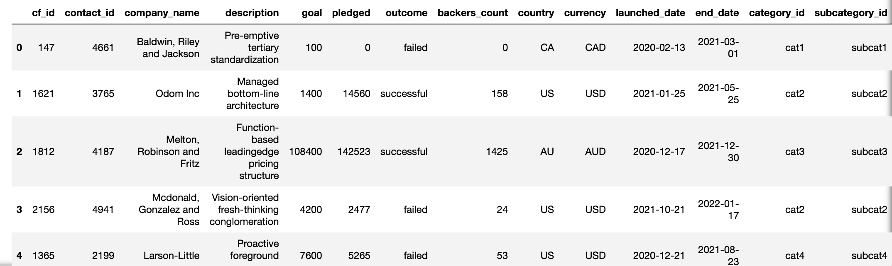

# Crowdfunding_ETL
The team developed an ETL pipeline for loading crowdfunding data from Excel files into a relational database using Python, Pandas, and PostgreSQL. 

## Background 

We developed an ETL pipeline to process crowdfunding data from Excel files as practice for this project. The data was extracted and processed it, then used the four CSV files to build an entity relationship diagram (ERD) and a table schema. The CSV files were then added to a PostgreSQL database.

## Instructions

The instructions for this mini project are divided into the following subsections:
Create the Category and Subcategory DataFrames
Create the Campaign DataFrame
Create the Contacts DataFrame

### 1. Create the Category DataFrame

### 2. Create the Subcategory DataFrame

### 3. Create the Campaign DataFrame 

### 4. Create the Contacts DataFrame

### 5. Create ERD
### 6. Create tables for CAtegory, Subcategory, Contacts and Campaign in pgAdmin and import csv files

#### Contributors:
Carolina Menegoli  
Laura Lang